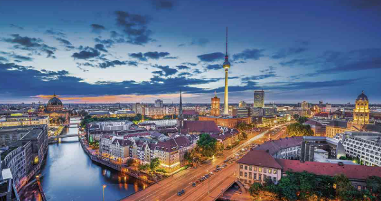

# Berlin, Alemania

## Descripcion
Berlín es una vibrante capital alemana que fusiona una historia profunda (Muro de Berlín, Guerra Fría) con modernidad, arte urbano y una intensa vida cultural.

## Recomendacion
Ideal para visitar entre mayo y septiembre por su buen clima, se recomienda planear al menos 3 días para recorrer sus monumentos, museos y barrios alternativos. 

## Imagen
