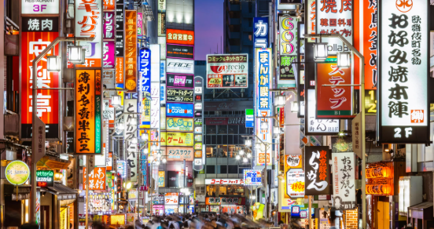

# Tokyo, Japon

## Descripcion
Tokio, la metrópoli más poblada del mundo, es una fascinante mezcla de tradición milenaria y modernidad futurista. Ofrece templos, jardines, gastronomía de clase mundial, y barrios icónicos como Shibuya y Akihabara.

## Recomendacion
Se recomiendan entre 3 y 5 días para explorar, idealmente usando el metro, y reservando alojamiento con antelación para asegurar buenos precios.

## Imagen

## Informacion
- Ubicación: Costa oriental de Honshu, región de Kanto, limitando con el Océano Pacífico al este y prefecturas como Chiba, Saitama y Kanagawa.
- Población: Área metropolitana (Gran Tokio) con más de 37-38 millones de habitantes, siendo la más poblada del mundo. La ciudad central de Tokio tiene aprox. 14 millones.
- Clima: Templado-subtropical húmedo. Veranos calurosos y húmedos, inviernos fríos y secos, y temporadas de lluvias (junio-julio).
- Estructura: Se compone de 23 distritos especiales (antigua ciudad de Tokio), 26 ciudades satélite, 5 ciudadelas y 8 aldeas.