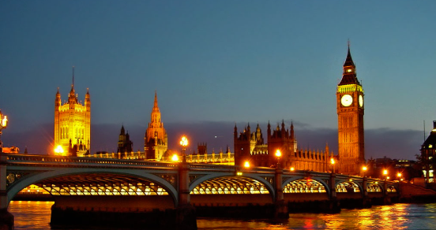

# Londres, Reino Unido e Inglaterra

## Descrcipcion
Londres, capital del Reino Unido e Inglaterra, es una metrópoli global ubicada en el sureste de Gran Bretaña a orillas del río Támesis.

## Recomendacion
 Se requiere pasaporte en vigor, y a partir de 2025, el permiso ETA es obligatorio. 

## Imagen
 
