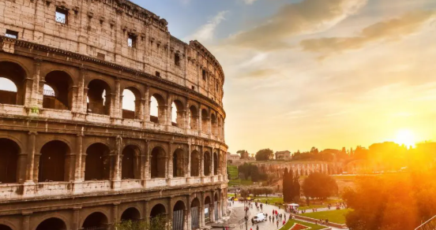

# Roma, Italia

## Descripcion
Roma, la "Ciudad Eterna", es un tesoro de 2.500 años de historia que mezcla ruinas imperiales, arte renacentista y vibrante cultura moderna.

## Recomendacion
Es imprescindible visitar el Coliseo, el Vaticano y la Fontana di Trevi, preferiblemente entre abril-mayo o septiembre-octubre para evitar el calor extremo y las multitudes.

## Imagen

