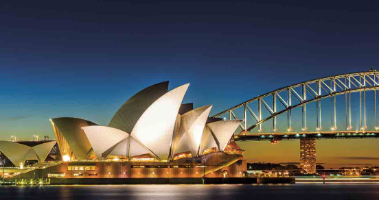

# Sidney, Australia

## Descripcion
Sídney es una vibrante metrópolis australiana famosa por su espectacular puerto, la Ópera y playas icónicas como Bondi. Combina naturaleza y vida urbana, ofreciendo historia en The Rocks y modernidad en el CBD. 

## Recomendacion
Ideal para visitar entre 5 días y una semana, destaca por su clima agradable y ambiente. 

## Imagen
